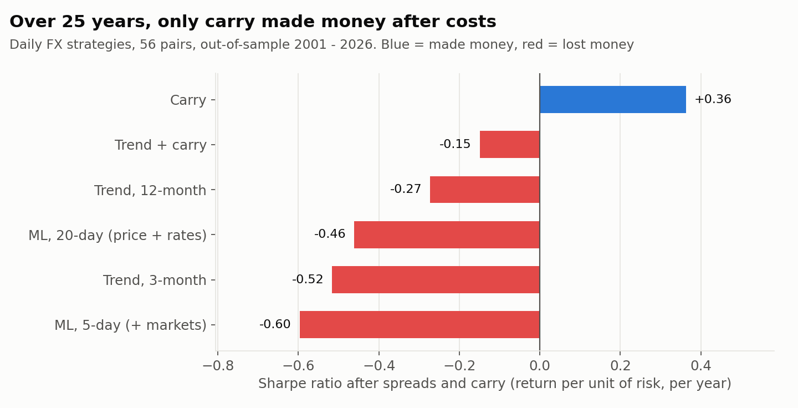
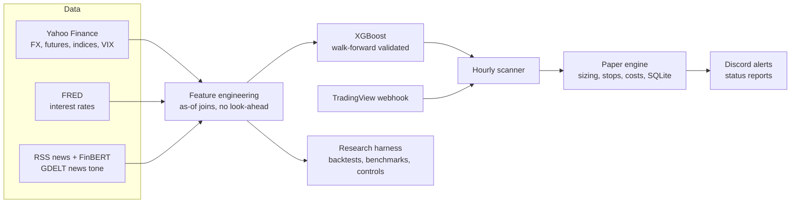
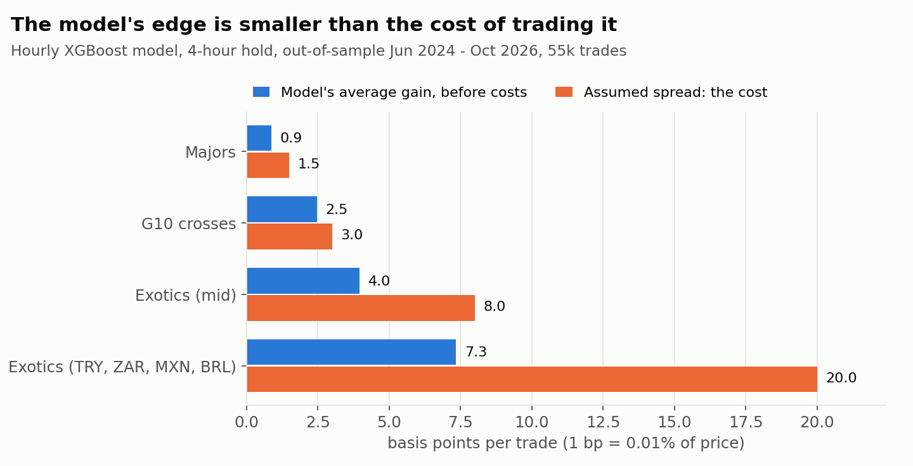
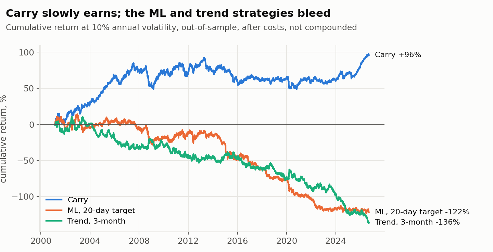

# Can machine learning trade FX profitably with free data? An honest test

I built an end-to-end machine-learning FX trading system: data pipeline, news sentiment, XGBoost model,
TradingView/Discord integration and an automated paper-trading engine. Then I tried hard to prove it works.
**It doesn't, and this document shows exactly why.** The only strategy that survived realistic costs was
a simple, well-known one: holding higher-interest-rate currencies (carry).



## TL;DR

| Question | Answer |
|---|---|
| Does the hourly model predict direction? | **Yes, slightly.** 56.8% accurate live, 65.5% on its confident signals, matching validation |
| Does that make money? | **No.** Average edge 3.9 bps per trade vs ~8.5 bps of spread: **-4.6 bps per trade** after costs |
| Do other targets help (12h, 24h, 48h trends, "which price is hit first")? | Not reliably. Best case is about break-even on major pairs |
| Do futures, stocks, VIX, interest rates or 3 years of news sentiment help? | **No.** They made out-of-sample results slightly *worse* |
| Does a daily/weekly ML model work better? | **No.** Sharpe -0.46 to -0.60 after costs, and about **0.0 even before costs** |
| What did work? | **Carry**: Sharpe +0.36 out-of-sample (2001-2026), +0.48 over 30 years |
| Is *anything* predictable? | **Yes: volatility.** A simple model explains 43% of next-day volatility, vs 17% for "same as yesterday" |

## The system



- **Data:** about 850k hourly bars across 50 FX pairs; 30 years of daily FX; 9 futures and indices; 21 central-bank short rates; live headlines scored by FinBERT; and 600k rows of hourly news tone per currency from GDELT via BigQuery.
- **Live system:** a background service with an hourly scanner, a paper-trading engine with stops, time exits and per-currency exposure limits, a weekly carry rebalancer, Discord alerts and a status CLI.
- **Research harness:** walk-forward backtests with costs, alternative prediction targets (4–48h direction, first-touch levels), three feature sets, daily-horizon portfolio tests, simple benchmarks and sanity controls.

## Methodology: how I tried not to fool myself

1. **Walk-forward validation only.** Models are trained on the past and tested on the following period, never shuffled. Training rows whose label resolves inside the test window are **purged**, so overlapping labels can't leak.
2. **Information is time-stamped by when it was known.** Hourly bars count as known at their close. Monthly interest rates are used only 2 months after the month starts, because of publication lag. Daily market data is lagged one day, since the FX close can come before the US equity close. News counts only once its hour has ended.
3. **Costs on every trade:** a round-trip spread per pair tier (1.5 bps majors, 3 bps G10 crosses, 8–20 bps exotics), plus daily interest (carry) on multi-day positions.
4. **Sanity controls for the backtester itself:** perfect foresight scores Sharpe **+27**, and random positions score **~0** before costs. If either failed, every other number would be suspect.
5. **Leak hunting.** While building the live monitor I found a 1-hour look-ahead in the news features: a pandas
   constructor re-aligned "known at" timestamps by label. I fixed it and reran every news result, and the numbers here are
   the corrected ones. (The leak had *flattered* news and it still didn't help, so the conclusion didn't change.)
6. **Data cleaning.** The first daily equity curve showed a fake one-day crash in 2003. The cause was bad Yahoo prints: EURPLN "+58% in a day", TRYJPY off by 10× before 2007, and stale USDBRL prices before 2006. They're now filtered, and real shocks (the 2015 Swiss franc unpeg, the lira crises in 2018 and 2021, the rand in 2008) are kept.

## Finding 1: accuracy is not profit

The hourly model predicts the 4-hour direction correctly 56.8% of the time on new live data, and 65.5% when it's confident. That's the same as in validation. Yet the live paper trades won only **30%** of the time (14 of 46) and lost $6,825.

Two different questions were being answered:
- **The model answers:** "Will the price be higher in 4 hours?"
- **A trade with a 2× take-profit and a 1.5-ATR stop asks:** "Will the price travel 66 bps up before it travels 33 bps down?"

Even a coin flip wins that second game only about 1 time in 3. The model's average edge (about 6 bps over 4 hours) is tiny next to a 33 bps stop, so ordinary noise stops it out. Of the trades pointing the right way 4 hours after entry, only 37% won.

## Finding 2: the edge is real but smaller than the cost of trading it



Holding each signal for exactly the 4 hours the model predicts (55,410 out-of-sample trades, Jun 2024–Oct 2026):

| Pair type | Direction right | Gain before costs | Assumed spread | After spread |
|---|---|---|---|---|
| Majors | 55% | 0.9 bps | 1.5 bps | **-0.6** |
| G10 crosses | 61% | 2.5 bps | 3 bps | **-0.5** |
| Exotics (mid) | 65% | 4.0 bps | 8 bps | **-4.0** |
| Exotics (TRY, ZAR, MXN, BRL) | 65% | 7.3 bps | 20 bps | **-12.7** |

71% of confident signals simply bet against the previous hour's move. The model does beat that naive rule (0.9 vs 0.0 bps gross on majors), but the pattern looks a lot like bid/ask noise in free mid-quotes, which no one can trade.

## Finding 3: different targets and more data don't fix it

**Targets** (out-of-sample, trading only when the expected move beats the spread, bps per trade after costs):

| Target | Result |
|---|---|
| Direction in 4h | +0.5 (only +0.3 on majors/G10) |
| Direction in 12h | +0.7 (+0.2 on majors/G10) |
| Direction in 24h / 48h ("trend") | -1.5 / -3.8 |
| First touch of +1.5 / -1.5 ATR within 24h | +1.6 (+0.2 on majors/G10) |

The positive totals come almost entirely from TRYJPY. That's a structural lira devaluation the backtest doesn't charge interest for, and holding that trade really costs about 40% a year.

**More inputs** (same rows, Jun 2024–Oct 2026):

| Inputs | 4h | 12h | First touch 24h |
|---|---|---|---|
| A: price only | **+0.19** | **+0.05** | **+0.94** |
| B: + futures, stocks, VIX, dollar index, interest rates | -0.25 | -1.16 | -0.11 |
| C: + 3 years of GDELT news tone | -0.23 | -1.09 | -0.21 |

By the time an hourly bar closes, moves in other markets are already reflected in FX prices. Rate differences work over months, not hours. And with only about 2.3 years of hourly data, extra inputs mostly let the model memorise pair-specific quirks. Its most-used inputs were time of day and currency identity.

## Finding 4: at the daily horizon, only carry works



56 pairs, rebalanced daily, each pair risk-weighted, reported at 10% annual volatility, after spreads and carry:

| Strategy | Sharpe (2001–2026, out-of-sample) |
|---|---|
| **Carry** (hold the higher-rate currency) | **+0.36** (+0.48 over 1996–2026) |
| Trend + carry | -0.15 |
| Trend, 12-month | -0.27 |
| Trend, 3-month | -0.52 |
| ML, 20-day target (price + rates) | -0.46, and **-0.01 before costs** |
| ML, 5-day target (+ markets) | -0.60 |
| ML, 5-day target + GDELT news (2024–2026 only) | -1.75 vs -1.28 without news |

Carry is different from prediction: you're **paid** to hold higher-yielding currencies, in exchange for the risk of sharp crashes (2008, the 2015 Swiss franc). That's a well-documented risk premium, not an information edge, which is why it survives when prediction doesn't. Its worst drawdown at 10% volatility was 35–44% (depending on the period), and retail broker interest markups would eat part of it.

## Finding 5: volatility *is* predictable

Direction is close to unpredictable, but **how much** prices will move is not. A HAR model (log volatility
from yesterday, last week and last month, plus day-of-week) forecasts next-day realized volatility for 9 G10 pairs
out-of-sample (walk-forward, Jan 2025–Oct 2026, 4,109 pair-days):

| Forecast | R² (log vol) | Median error |
|---|---|---|
| Same as yesterday | 0.17 | 28% |
| Last month's average | 0.36 | 25% |
| **HAR model** | **0.43** | **23%** |

Days the model ranks in its **lowest 20%** averaged **4.8%** annualised volatility, and its **highest 20%** averaged
**11.0%**. That's useful for sizing positions and knowing when to be careful, even though it says nothing about direction.

## What I built from this: an FX Risk & News Monitor

The findings say "don't sell predictions", so the project now publishes **information** instead: a Discord feed
for G10 currency traders (`src/monitor.py`).

- **☀️ Morning briefing**, before each FX day: today's high-impact releases, a volatility outlook per pair
  (the Finding 5 model), news tone vs normal per currency (GDELT, kept live from its 15-minute raw files),
  short-term interest rates and the strongest FinBERT-scored headlines.
- **Alerts, important only:** a reminder 30 minutes before high-impact releases, unusually large hourly moves (4× normal),
  unusual news-tone swings (beyond ±2.5σ) and central-bank rate changes.

Every message is labelled *information only, not financial advice*.

## Why prediction fails here

Every input this system uses (prices, futures, rates, news tone) is public and seen within milliseconds by banks and funds with better data, lower costs and faster execution. Whatever predictive content exists gets traded away until what's left is smaller than a retail spread. The model isn't broken: it reliably finds a 4–8 bps pattern. That pattern just isn't worth paying 8.5 bps to trade.

## Limitations

- **Prices:** Yahoo mid-quotes, with no real bid/ask. Spreads are tier assumptions, not broker quotes.
- **Fills:** entry at the bar close (live fills happen about 90 seconds later). Backtests don't charge broker interest markups.
- **Model coverage:** one model family (XGBoost with fixed, untuned hyperparameters, deliberately, to avoid overfitting). Some tests use 3 folds, and the news history covers only 3 years.
- **Paper evidence:** 46 live paper trades is a small sample. The backtests carry most of the evidence.

## Reproduce

```bash
./setup.sh && source .venv/bin/activate
python -m src.data_collection && python -m src.train      # hourly data + model
python -m src.backtest                                    # Finding 2
python -m src.research_targets                            # Finding 3, targets
python -m src.macro_data && python -m src.research_features   # Finding 3, inputs (news: see sql/)
python -m src.research_daily                              # Finding 4
python -m src.vol_model validate                          # Finding 5
python scripts/make_charts.py                             # figures
```

GDELT news tone: run `sql/gdelt_currency_tone.sql` in Google BigQuery (the free sandbox is enough) and save the CSV into `data/gdelt/`.

## What I learned

- **Measure the trade, not the prediction.** Accuracy, win rate and profit answer three different questions.
- **Costs decide everything at short horizons.** Ask "how big is my edge compared with my spread?" first.
- **Build the controls first.** A perfect-foresight test and a random test catch evaluation bugs before they turn into false hope.
- **Plot the data before trusting it.** One bad price from 2002 created a fake crash in the results.
- **A negative result is a result.** Knowing *why* something doesn't work is what makes the next idea better.
